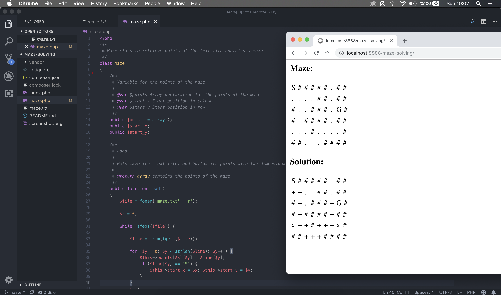

I was asked to write a script to find a possible path in a maze.

# Resources #

* https://www.youtube.com/watch?v=9KyFBcwFSso
* https://www.cs.bu.edu/teaching/alg/maze/
* https://github.com/kidino/PHP-Maze-Recursive-Solving